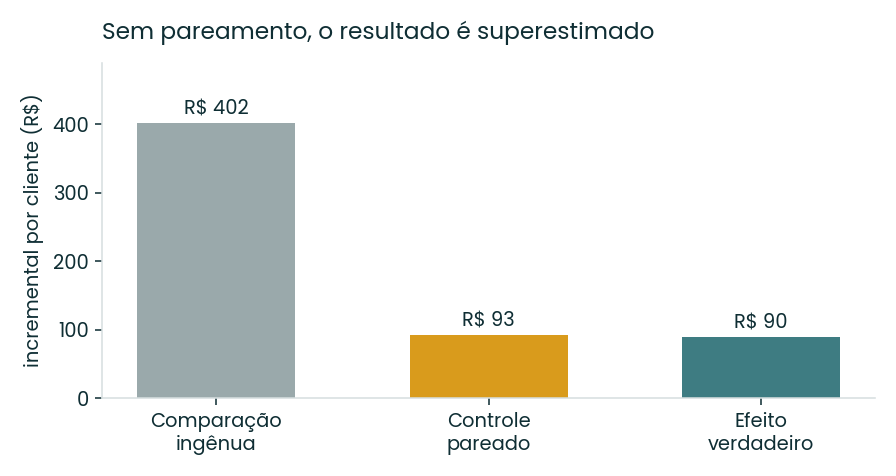
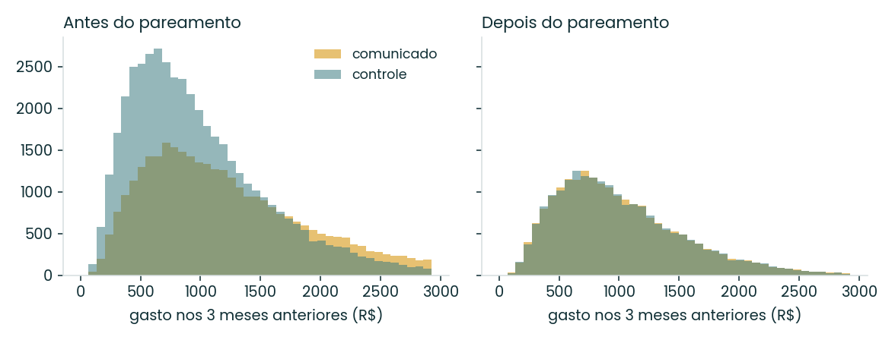
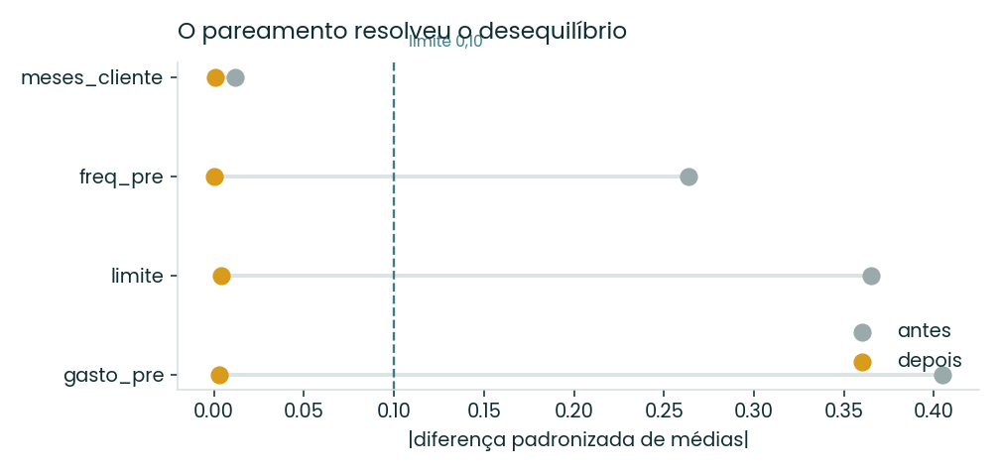
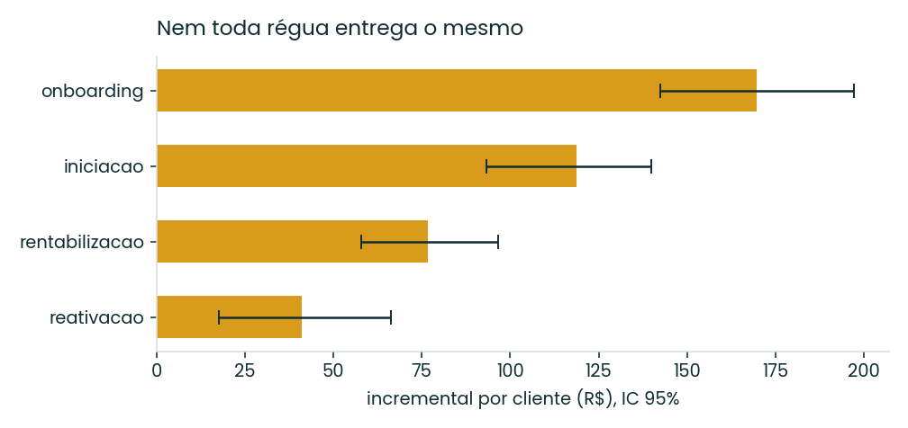

# Quanto disso teria acontecido de qualquer jeito?

Mensuração de faturamento incremental de campanhas quando o grupo de controle
**não foi aleatorizado** — o caso real de quase toda operação de CRM.

Uma campanha de cartão sobe. O faturamento de quem recebeu é maior que o de
quem não recebeu. A área comemora. O problema é que a campanha mirou justamente
quem já gastava mais — então boa parte dessa diferença teria acontecido sem
nenhuma comunicação.

Este projeto mostra o tamanho do erro e como corrigi-lo.

---

## Resultado

| | Incremental por cliente | Erro |
|---|---|---|
| Comparação ingênua (comunicados × todo o resto) | R$ 401,60 | **+345%** |
| Controle pareado por KNN | R$ 92,95 | +3% |
| Efeito verdadeiro | R$ 90,25 | — |

A comparação ingênua superestima o resultado da campanha em **4,5 vezes**.
Traduzido para decisão: é a diferença entre manter uma régua que se paga e
manter uma régua que queima verba.



O efeito verdadeiro é conhecido porque a base é sintética e o contrafactual de
cada cliente foi gerado explicitamente. Isso permite **auditar o estimador**, o
que nenhuma base real de campanha permite.

---

## O problema: quem foi comunicado já era diferente

Antes de qualquer correção, os dois grupos não são comparáveis:

| Covariável | Comunicados | Não comunicados | SMD |
|---|---|---|---|
| gasto_pre | R$ 1.315,88 | R$ 1.015,75 | 0,405 |
| limite | R$ 5.680,51 | R$ 4.383,59 | 0,365 |
| freq_pre | 9,73 | 8,62 | 0,264 |
| meses_cliente | 61,1 | 60,7 | 0,012 |

SMD é a diferença padronizada de médias. A convenção é que acima de 0,10 os
grupos não são comparáveis. Três das quatro covariáveis passam de 0,25.



---

## O método

**Pareamento 1:1 por vizinho mais próximo**, dentro de cada segmento
comportamental:

1. Covariáveis padronizadas dentro do segmento, para que limite (milhares) e
   frequência (dezenas) pesem igual na distância.
2. KNN sem reposição — cada controle é usado uma única vez, evitando que um
   cliente muito "médio" vire par de centenas de tratados e infle a precisão.
3. Caliper de 0,25 desvio: par distante demais é descartado em vez de aceito.
   Custa amostra (59,9% dos comunicados foram pareados) e compra credibilidade.
4. Ordem de pareamento aleatorizada, para que os primeiros tratados da base não
   fiquem com os melhores controles só por posição.

**Validação antes de olhar o resultado.** O balanceamento é checado primeiro;
se as covariáveis não fecham, a estimativa não é reportada.



Após o pareamento, o |SMD| máximo cai de 0,405 para **0,004**.

**Significância** por Mann-Whitney (gasto é assimétrico e com massa em zero,
então teste t não serve) e intervalo de confiança por bootstrap:

```
Incremental pareado: R$ 92,95   IC95% [81,61 ; 104,26]
Mann-Whitney U = 229.074.540    p = 3,5e-59
```

---

## Quebra por estratégia

O número agregado não serve para decidir. O que decide é qual régua entrega.

| Estratégia | n | Incremental | IC 95% | Efeito real |
|---|---|---|---|---|
| onboarding | 3.203 | R$ 169,57 | [142,33 ; 197,23] | R$ 173,85 |
| iniciação | 4.989 | R$ 118,80 | [93,26 ; 139,82] | R$ 110,26 |
| rentabilização | 7.368 | R$ 76,70 | [57,82 ; 96,68] | R$ 73,11 |
| reativação | 4.920 | R$ 41,18 | [17,53 ; 66,26] | R$ 45,47 |



O estimador recupera a ordem correta e acerta cada estratégia dentro do
intervalo. Reativação tem o intervalo mais largo — efeito menor e mais
disperso —, o que é exatamente o tipo de incerteza que precisa aparecer antes
de alguém decidir cortar a régua.

---

## Dois problemas vizinhos

**O holdout define o que você consegue enxergar.** Numa base elegível de 2
milhões, um holdout de 5% detecta efeitos a partir de R$ 12,73 por cliente
(1,1% do gasto médio). Para detectar R$ 5 seria preciso deixar 61,5% da base
sem comunicação — ou seja, esse efeito é inatingível na prática, e saber disso
antes evita meses de teste sem conclusão.

**Cobertura ou frequência.** Com capacidade de disparo finita, o arranjo ótimo
não é nenhum dos extremos: duas comunicações para 75% da base rende 10% mais
que uma comunicação para 100%. A partir de oito contatos, a resposta por pessoa
fica negativa.

Ambos em `desenho_e_frequencia.py`.

---

## Limitações

Ser honesto sobre o que o método não faz é parte do método.

- **Pareamento só corrige o que foi observado.** Se a seleção dependeu de algo
  fora da base (propensão a crédito, canal preferido), o viés permanece. Não
  existe teste que prove a ausência de confundidor não observado.
- **O caliper descarta 40% dos tratados.** O resultado passa a valer para a
  região de suporte comum, não para toda a base. Extrapolar é escolha, e deve
  ser declarada.
- **Aleatorizar um holdout é melhor.** Quando dá para segurar 5% da base sem
  comunicação, isso resolve o problema na origem. Pareamento é o que se faz
  quando a campanha já subiu.

---

## Rodando

```bash
pip install -r requirements.txt
python gerar_dados.py            # gera a base
python analise.py                # matching, testes e figuras
python desenho_e_frequencia.py   # holdout e cobertura x frequência
```

## Sobre os dados

A base é **sintética**, gerada pelo script deste repositório. Foi uma escolha,
não uma limitação: é o único jeito de ter o contrafactual verdadeiro e provar
que o estimador acerta.

Para rodar contra dado público real, os dois mais próximos deste problema são
o **Hillstrom MineThatData Email Challenge** (64 mil clientes, campanha de
e-mail com controle e gasto como desfecho) e o **Criteo Uplift Prediction
Dataset**. O pipeline em `analise.py` só depende das colunas `comunicado`,
`gasto_pos` e das covariáveis pré-campanha — trocar a fonte é mudar o
`read_csv` e a lista `COVARIAVEIS`.

---

Nicolas Oliveira · [linkedin.com/in/nicolasoliveira23](https://www.linkedin.com/in/nicolasoliveira23) · [nicx23.github.io](https://nicx23.github.io)
